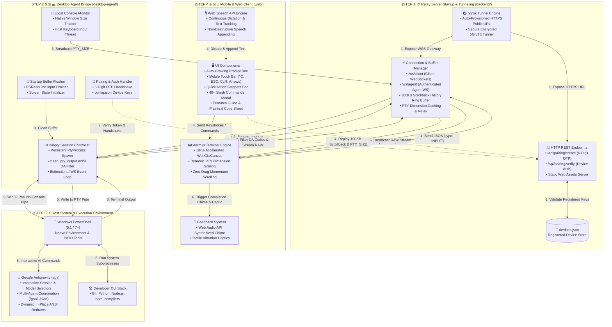

# 🚀 TermPilot

> **Next-Gen Mobile Terminal Companion & Remote AI Agent Controller**

TermPilot is a low-latency, mobile-first terminal interface and relay pipeline designed to let developers seamlessly monitor, execute commands, dictating prompts via voice, and control AI coding assistants (like Google Antigravity `agy`) directly from their smartphones with a native app feel.

---

## ⚡ Key Features

* **🎙️ Voice Dictation (Speech-to-Text)**: Live speech-to-text transcription with real-time text tracking.
* **📱 100% Native Mobile Kinetic Scroll**: Hardware-accelerated GPU momentum scrolling with zero drag and boundary containment.
* **⚡ 40+ Antigravity Slash Commands**: Full interactive modal with instant search and 1-tap execution for `/plan`, `/goal`, `/mcp`, `/skills`, etc.
* **📜 Smart Command History & Gestures**: Swipe left/right across the prompt box or tap `▲` / `▼` to cycle through recent prompts stored in `localStorage`.
* **🚀 Quick Action Snippets Bar**: 1-tap pills for `git status`, `git diff`, `dir`, `python`, plus `+ Add` to save custom command pins permanently.
* **📋 Native Mobile Long-Press Text Selection**: Long-press on the terminal to select text with blue pins, magnifying loupe, and native Copy/Share menus or 1-tap quick copy.
* **🔔 Task Completion Audio Alert**: Web Audio API synthesized melodic chime (`C5 -> G5`) automatically triggers when long-running AI tasks finish.
* **📳 Haptic Tactile Feedback**: Subtle vibration feedback on button presses, mic activation, swipe history navigation, and command execution.
* **🔒 Secure WebSocket Relay & Pairing**: 6-digit one-time token pairing and local network / ngrok tunneling.

---

## 🏗️ Comprehensive System Architecture & Execution Flow



---

### 🗺️ Step-by-Step Operational Lifecycle

| Step | Stage | What Happens |
| :--- | :--- | :--- |
| **`STEP 1`** | **Relay Startup** | `python main.py` starts the FastAPI backend, mounts static web assets, loads `devices.json`, provisions the public `ngrok` HTTPS tunnel, and initializes the 100KB rolling scrollback buffer. |
| **`STEP 2`** | **Device Pairing** | On first use, the mobile client requests a 6-digit OTP code. The desktop agent verifies the code via `python agent.py --pair <code>`, receiving an authenticated `device_id` and `secret_key` saved to `config.json`. |
| **`STEP 3`** | **PTY Session Spawn** | Desktop agent connects to `/ws/agent`, spawns a persistent PowerShell session using `winpty`, drains initial probe codes, and broadcasts native console dimensions (`PTY_SIZE`). |
| **`STEP 4`** | **Mobile Connect & Input** | Mobile client connects to `/ws/client`, immediately receives replayed scrollback history, dynamically scales font size to match `PTY_SIZE`, and sends typed, spoken (`🎙️`), or touch-bar (`▲`, `▼`, `⌃C`) commands as `{type: "INPUT"}` JSON payloads. |
| **`STEP 5`** | **Execution & AI Orchestration** | Input is piped to the persistent Win32 ConPTY. PowerShell and Google Antigravity (`agy`) execute instructions, run subagent reasoning loops, and handle interactive in-place menu shuffling. |
| **`STEP 6`** | **Output Stream & Feedback** | PTY output is filtered for device attribute artifacts and streamed over WebSocket to `xterm.js`. Upon command completion, a melodic Web Audio chime triggers and tactile haptic vibrations pulse. |

---

## 🚀 Quick Start

### 1. Prerequisites
* Python 3.10+
* (Optional) `ngrok` for public remote phone access over 5G/LTE

### 2. Start the Backend Relay
```bash
cd backend
pip install -r requirements.txt
python main.py
```

### 3. Connect the Desktop Agent
```bash
cd desktop-agent
pip install -r requirements.txt
python agent.py
```
*(If pairing for the first time, run `python agent.py --pair <6-digit-code>` shown on your phone screen).*

### 4. Open on Mobile
Navigate to the local or ngrok HTTPS URL on your phone's browser, tap the **`💡 FEATURES`** button to view available shortcuts, and start coding on the go!

---

## 📄 License
MIT License. Created by [Astroash2001](https://github.com/Astroash2001).
